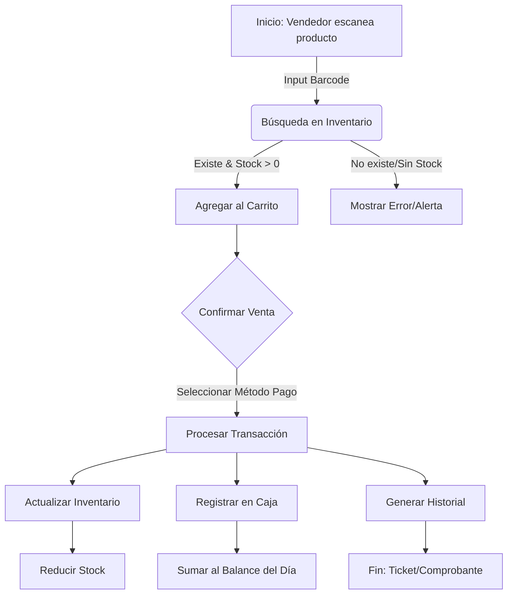

# 📘 Documentación Técnica: StockFlow (Sistema de Ventas e Inventario)

**Versión:** 1.0.0
**Tecnología:** Python / Reflex
**Autor:** GitHub Copilot (Asistente Técnico)

---

## 1. Visión General del Proyecto

**StockFlow** es una aplicación web integral diseñada para la gestión de pequeños y medianos comercios. Su objetivo principal es centralizar el control de inventario, el punto de venta (POS) y la administración financiera (Caja) en una interfaz unificada, reactiva y moderna.

### Propósito
El sistema resuelve la necesidad de digitalizar operaciones manuales, permitiendo:
*   Control en tiempo real del stock.
*   Procesamiento rápido de ventas mediante códigos de barra.
*   Gestión segura de efectivo mediante aperturas y cierres de caja.
*   Administración de usuarios con roles y privilegios granulares.

### Stack Tecnológico
*   **Lenguaje Core:** [Python 3.10+](https://www.python.org/)
*   **Framework Full-Stack:** [Reflex](https://reflex.dev/) (Manejo de Frontend y Backend en Python puro).
*   **Estilos:** [Tailwind CSS](https://tailwindcss.com/) (Integrado nativamente en Reflex).
*   **Persistencia:** Gestión de Estado en Memoria / Estructuras de Datos Python (Listas/Diccionarios) con capacidad de expansión a SQLModel/SQLAlchemy.
*   **Iconografía:** Lucide Icons (vía `rx.icon`).

---

## 2. 🏗️ Arquitectura del Sistema

El proyecto sigue una arquitectura basada en **Componentes y Estado**, típica de aplicaciones Reflex. Se separa claramente la lógica de negocio (State) de la interfaz de usuario (Pages/Components).

### Estructura de Directorios
```text
Sistema-de-Ventas/
├── app/
│   ├── components/      # Biblioteca de componentes UI reutilizables (Atom Design)
│   │   ├── ui.py        # Botones, Inputs, Modales, Tablas estandarizados
│   │   └── sidebar.py   # Navegación principal
│   ├── pages/           # Vistas de la aplicación (Rutas)
│   │   ├── caja.py      # Gestión financiera
│   │   ├── venta.py     # Punto de Venta (POS)
│   │   ├── ingreso.py   # Entrada de mercancía
│   │   └── ...
│   ├── states/          # Lógica de estado modularizada
│   │   └── auth_state.py # Lógica de autenticación
│   ├── state.py         # Estado global y lógica de negocio principal
│   └── app.py           # Punto de entrada y definición de rutas
├── assets/              # Recursos estáticos
└── requirements.txt     # Dependencias del proyecto
```

### Patrón de Diseño: State Management
Reflex utiliza un flujo de datos unidireccional.
1.  **Eventos:** El usuario interactúa con la UI (click, input).
2.  **Handler:** Se ejecuta una función en el Backend (`State`).
3.  **Update:** El estado se actualiza (variables reactivas).
4.  **Render:** La UI se redibuja automáticamente reflejando los cambios.

### Diagrama de Flujo: Ciclo de Vida de una Venta



---

## 3. 📦 Módulos Principales (Análisis Funcional)

### A. Módulo de Ventas (`app/pages/venta.py`)
Es el núcleo transaccional del sistema.
*   **Funcionalidad:** Permite la búsqueda de productos por autocompletado o código de barras.
*   **Lógica Clave:**
    *   Mantiene una lista temporal `sale_items` (el carrito).
    *   Calcula subtotales y totales en tiempo real (`computed_vars`).
    *   Valida que la cantidad solicitada no exceda el `current_stock`.

### B. Módulo de Caja (`app/pages/caja.py`)
Controla el flujo de dinero y la seguridad financiera del turno.
*   **Funcionalidad:** Apertura de caja (monto inicial), registro de ventas, y cierre de caja (arqueo).
*   **Refactorización Reciente:** Implementa un diseño *Mobile-First* y utiliza componentes de `ui.py` para consistencia visual.
*   **Características:**
    *   Bloqueo de ventas si la caja está cerrada.
    *   Desglose de ingresos por método de pago (Efectivo, Tarjeta, Transferencia).
    *   Historial de logs (Aperturas/Cierres) con auditoría de usuario.

### C. Módulo de Ingresos (`app/pages/ingreso.py`)
Gestiona la entrada de mercancía al almacén.
*   **Funcionalidad:** Permite sumar stock a productos existentes o crear nuevos productos.
*   **Lógica:** Actualiza el inventario global y recalcula costos (si aplica). Genera un registro histórico de movimientos de tipo "Entrada".

### D. Gestión de Usuarios y Seguridad (`app/states/auth_state.py`)
Maneja la identidad y los permisos dentro del sistema.
*   **Funcionalidad:** Login, Logout y protección de rutas.
*   **RBAC (Role-Based Access Control):**
    *   Define roles (Admin, Cajero, Vendedor).
    *   Cada rol tiene un diccionario de privilegios (ej: `can_delete_sales`, `view_reports`).
    *   La UI utiliza `rx.cond` para ocultar botones o secciones según los privilegios del usuario logueado.

---

## 4. 💾 Modelo de Datos

Aunque el sistema utiliza estructuras de Python en `app/state.py`, las entidades lógicas que gobiernan el sistema son:

### Entidades Principales

| Entidad | Atributos Clave | Descripción |
| :--- | :--- | :--- |
| **User** | `username`, `password_hash`, `role`, `privileges` | Usuarios del sistema con sus permisos específicos. |
| **Product** | `barcode`, `description`, `stock`, `price`, `category` | Catálogo de artículos disponibles para la venta. |
| **Sale** | `id`, `timestamp`, `items`, `total`, `payment_method`, `user` | Registro inmutable de una transacción completada. |
| **CashboxLog** | `id`, `action` (open/close), `amount`, `user`, `timestamp` | Auditoría de los movimientos de apertura y cierre de caja. |
| **Movement** | `type` (in/out), `product_id`, `quantity`, `reason` | Trazabilidad de cambios en el inventario. |

### Variables de Estado Críticas
*   `State.products`: Lista maestra de inventario.
*   `State.cashbox_is_open`: Booleano que determina si se pueden procesar ventas.
*   `State.current_user`: Diccionario con la sesión activa del usuario.

---

## 5. 🚀 Guía de Instalación y Despliegue

Sigue estos pasos para levantar el entorno de desarrollo local.

### Prerrequisitos
*   Python 3.10 o superior.
*   Git.

### Pasos de Instalación

1.  **Clonar el repositorio:**
    ```bash
    git clone https://github.com/TreborOscorima/Sistema-de-Ventas.git
    cd Sistema-de-Ventas
    ```

2.  **Crear y activar entorno virtual:**
    *   *Windows (PowerShell):*
        ```powershell
        python -m venv .venv
        .venv\Scripts\activate
        ```
    *   *Linux/Mac:*
        ```bash
        python3 -m venv .venv
        source .venv/bin/activate
        ```

3.  **Instalar dependencias:**
    ```bash
    pip install -r requirements.txt
    ```

4.  **Inicializar Reflex (solo primera vez):**
    ```bash
    reflex init
    ```

5.  **Ejecutar la aplicación:**
    ```bash
    reflex run
    ```
    La aplicación estará disponible en `http://localhost:3000`.

---

## 6. 🛡️ Seguridad y Permisos

El sistema implementa seguridad a nivel de aplicación (Application Level Security).

### Autenticación
Se utiliza `AuthState` para validar credenciales contra la lista de usuarios. Al loguearse exitosamente, se establece `State.current_user`.

### Autorización (Privilegios)
En lugar de solo verificar roles (ej: "es admin"), el sistema verifica **capacidades**.

**Ejemplo de protección en código (`caja.py`):**
```python
rx.el.button(
    "Eliminar Venta",
    on_click=State.delete_sale,
    # El botón se deshabilita si el usuario no tiene el privilegio específico
    disabled=~State.current_user["privileges"]["delete_sales"]
)
```

**Protección de Vistas:**
Las páginas completas están envueltas en condicionales que verifican si el usuario tiene permiso de visualización (`view_cashbox`, `view_ventas`, etc.). Si no lo tiene, se renderiza un componente de "Acceso Denegado".

---

*Documentación generada automáticamente el 3 de diciembre de 2025.*
